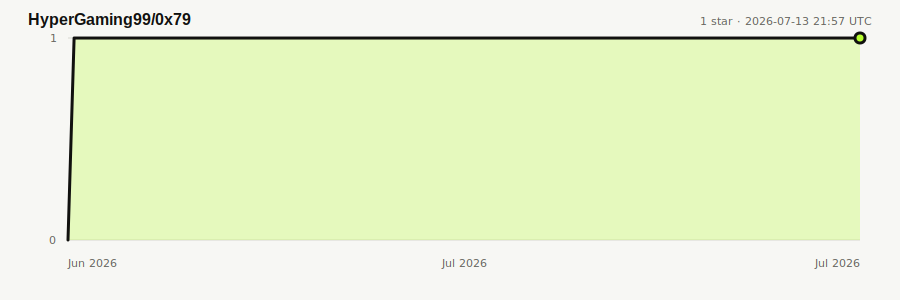

# 0x79

An independent, self-hosted web utility platform written in plain PHP.

[](https://github.com/HyperGaming99/0x79/releases/latest)
[](https://www.php.net/)
[](https://hits.sh/github.com/HyperGaming99/0x79/)
[](LICENSE)

**Live:** [0x79.one](https://0x79.one) · [Tools](https://0x79.one/tools) · [Status](https://0x79.one/status) · [API docs](https://0x79.one/api/docs)

## Features

| Area | Included |
| --- | --- |
| URL shortener | Custom aliases, passwords, expiry dates, click limits, previews and branded QR codes |
| File host | File and image uploads, public links and inline previews |
| Paste host | Text, raw output, passwords, burn limits and encrypted pastes |
| Music promoter | Release landing pages with verified streaming-platform links |
| Discord Presence | Bot-backed presence, activities, Spotify, REST API and Lanyard-style WebSocket |
| Minecraft status | Java Edition MOTD, version, player count, player sample, favicon and latency |
| Privacy tools | Local metadata cleaning and AES-GCM secure sharing |
| Platform | Accounts, analytics, API keys, admin dashboard, tool directory and live status page |
| Interface | Shared responsive navigation, German/English language switch and light/dark themes |

Guest content expires after 14 days. Content created with an account stays available unless an expiry date is set.

## Requirements

- PHP 8 or newer
- Supabase or PostgreSQL
- Supabase Storage or an S3-compatible service

There is no framework or build step. The frontend is server-rendered HTML with Tailwind loaded from its CDN.

## Quick start

Clone the repository:

```sh
git clone https://github.com/HyperGaming99/0x79.git
cd 0x79
```

Copy the example configuration:

```sh
cp .env.sample .env
```

At minimum, configure an admin key and one database/storage backend:

```env
ADMIN_API_KEY=change-me

DB_DRIVER=supabase
STORAGE_DRIVER=supabase

SUPABASE_URL=https://your-project.supabase.co
SUPABASE_KEY=your-key
SUPABASE_SERVICE_ROLE_KEY=your-service-role-key
```

Start the development server:

```sh
php -S localhost:8000 index.php
```

Open [localhost:8000](http://localhost:8000). There is no framework, package installation or frontend build step.

## Configuration

Every public tool can be enabled or disabled independently:

```env
TOOL_SHORTENER_ENABLED=true
TOOL_UPLOAD_ENABLED=true
TOOL_PASTE_ENABLED=true
TOOL_MUSIC_ENABLED=true
TOOL_METADATA_ENABLED=true
TOOL_SECURE_SHARE_ENABLED=true
TOOL_DISCORD_ENABLED=true
TOOL_MINECRAFT_ENABLED=true
```

Disabled tools disappear from the dashboard and their creation pages and APIs return `404`.

For PostgreSQL, set `DB_DRIVER=postgres` and configure `POSTGRES_DSN` or the individual `POSTGRES_*` values. Run `schema.sql` to create the tables.

### Public monthly analytics

The landing page shows privacy-friendly totals for unique visitors, short-link clicks and newly created links in the current month. Existing installations must run the latest `schema.sql` (in the Supabase SQL Editor or through `psql`) once to create `site_visits`. Configure a stable random hashing salt:

```env
ANALYTICS_SALT=replace-with-the-output-of-openssl-rand-hex-32
```

Visitor analytics stores no raw IP address or User-Agent. A salted fingerprint that changes every month is used only to avoid counting the same visitor repeatedly.
Supabase deployments should configure `SUPABASE_SERVICE_ROLE_KEY`; the visitor table has RLS enabled and is intentionally unavailable through the anon key.

For S3 or MinIO, set `STORAGE_DRIVER=s3` and provide:

```env
S3_ENDPOINT=http://localhost:9000
S3_REGION=us-east-1
S3_BUCKET=files
S3_ACCESS_KEY=your-key
S3_SECRET_KEY=your-secret
S3_USE_PATH_STYLE=true
```

The storage bucket must allow public reads.

### Discord Presence bot

The optional `/discord` tool uses your own Discord bot and only sees presence for members of the configured server. Create a bot in the Discord Developer Portal, add it to the server, and enable both **Presence Intent** and **Server Members Intent** under **Privileged Gateway Intents**. The worker uses the same member/presence snapshot flow as Lanyard. Then configure:

```env
TOOL_DISCORD_ENABLED=true
DISCORD_BOT_TOKEN=your-bot-token
DISCORD_GUILD_ID=your-server-id
DISCORD_PRESENCE_CACHE=.discord-presence.json
DISCORD_WS_ENABLED=true
DISCORD_WS_PORT=8090
DISCORD_WS_PUBLIC_URL=wss://your-domain.example/discord/socket
```

The default cache is stored inside the shared project directory. This is important when the worker runs on the host while the PHP website runs inside a container, because their `/tmp` directories are separate.

Never use a Discord user token. Docker starts the Gateway worker automatically. For local development without Docker, run the worker and web server in separate terminals:

```sh
php discord-worker.php
php discord-socket.php
php -S localhost:8000 index.php
```

The socket server speaks a Lanyard-style subscribe protocol on port `8090`. Put it behind a WebSocket-capable reverse proxy and set `DISCORD_WS_PUBLIC_URL` to the public `wss://` address. `subscribe_to_all` stays disabled by default; enable it explicitly with `DISCORD_WS_ALLOW_SUBSCRIBE_ALL=true` only if exposing every cached member is intended.

### Minecraft server status

The optional `/minecraft` tool queries public Minecraft Java servers directly and follows `_minecraft._tcp` SRV records. Private and reserved network targets are rejected.

```env
TOOL_MINECRAFT_ENABLED=true
MINECRAFT_QUERY_TIMEOUT=4
```

The JSON endpoint is available at `/api/minecraft?server=play.example.net`.

### Tool dashboard and status

- `/tools` provides a searchable, categorized directory of every enabled utility.
- `/status` shows the current application, database, storage, Discord worker and tool states and refreshes every 30 seconds.

## Docker

Create the `.env` file described above, then run:

```sh
docker compose up --build
```

The app will be available at [localhost:8080](http://localhost:8080). Set `APP_PORT` to use a different host port:

```sh
APP_PORT=9000 docker compose up --build
```

Prebuilt images are published to GitHub Container Registry on every push to `main`:

```sh
docker pull ghcr.io/hypergaming99/0x79:latest
```

## API

Interactive documentation is available at [`/api/docs`](https://0x79.one/api/docs). Create an account to generate an API key for write endpoints.

| Endpoint | Purpose |
| --- | --- |
| `GET /api/discord?user_id=…` | Discord presence in a Lanyard-compatible response shape |
| `GET /api/minecraft?server=…` | Minecraft Java server status |
| `POST /api/paste` | Create a paste |
| `POST /api/file` | Upload a file |
| `POST /api/music` | Create a music landing page |
| `WS /discord/socket` | Live Discord presence subscriptions |

## Main routes

| Route | Page |
| --- | --- |
| `/tools` | Searchable tool dashboard with categories and activation state |
| `/status` | Application, backend, worker and tool status; refreshes every 30 seconds |
| `/posts` | News and project updates |
| `/account` | User content, analytics and API-key management |
| `/admin` | Administration dashboard |

## Star history

[](https://github.com/HyperGaming99/0x79/stargazers)

The chart is generated inside this repository and updated daily by GitHub Actions. No public access token is embedded in the README.

## Security

Do not commit `.env`. Uploads are type-checked, SVG uploads are blocked, and short-link targets are checked against private and blocked hosts.

## License and attribution

0x79 is licensed under the [BSD 3-Clause License](LICENSE). You may use, modify and redistribute the software, including commercially, as long as the copyright notice and license text remain included.

The attribution requirement is fulfilled by retaining the copyright notice and complete license text in source distributions or accompanying documentation. A visible project credit can use:

```text
0x79 by HyperGaming99 — https://github.com/HyperGaming99/0x79
```
